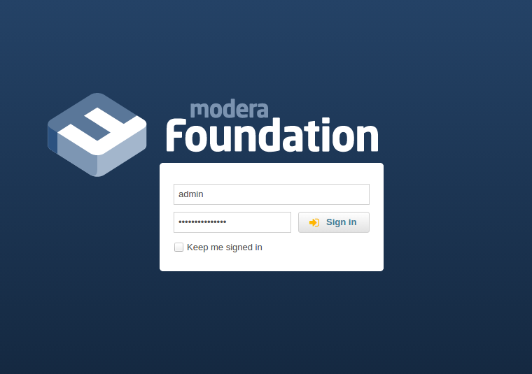

# Modera Foundation

RAD platform for developing applications using Symfony2, Doctrine, ExtJS ([MJR](https://mjr.dev.modera.org/)).



## Installation

If you are working under Debian-like operating system (like Ubuntu):

* Install [mcloud](https://mcloud.io)
* Optional. If you want to make sure that you won't reach github API call limit for anonymous users when composer is
working you can add [GitHub personal access token](https://github.com/settings/applications):

``` bash
$ mcloud set COMPOSER_GITHUB_OAUTH YOUR-TOKEN-HASH-GOES-HERE
```

* Go to directory where you cloned this repository and execute these commands:

``` bash
$ mcloud start --init
$ mcloud run php. "app/console modera:security:create-user"
```

## Manual installation

If you happen to run some other operating system then you will need to follow these steps:

* Download `http://cdn.sencha.com/ext/gpl/ext-4.2.1-gpl.zip` and extract it to `web/extjs` directory
* Download `http://mjr.dev.modera.org/releases/mjr.tar.gz` and extract it to `web/modera/mjr` directory
* Download `http://mjr.dev.modera.org/releases/mjr-theme.tar.gz` and extract it to `web/modera/theme` directory
* Install a composer, please read instructions at https://getcomposer.org/download/
* If you are running unix-like operating system, then you need to make app/cache and app/logs directories
   writable by both you and a web-server you are going to run Modera Foundation from. If your system supports
  `chmod +a` you can use this:

``` bash
$ rm -rf app/cache/*
$ rm -rf app/logs/*
$ HTTPDUSER=`ps aux | grep -E '[a]pache|[h]ttpd|[_]www|[w]ww-data|[n]ginx' | grep -v root | head -1 | cut -d\  -f1`
$ sudo chmod +a "$HTTPDUSER allow delete,write,append,file_inherit,directory_inherit" app/cache app/logs app/kernel.json
$ sudo chmod +a "`whoami` allow delete,write,append,file_inherit,directory_inherit" app/cache app/logs
```

  If executing these commands give you an error then try this:

``` bash  
$ HTTPDUSER=`ps aux | grep -E '[a]pache|[h]ttpd|[_]www|[w]ww-data|[n]ginx' | grep -v root | head -1 | cut -d\  -f1`
$ sudo setfacl -R -m u:"$HTTPDUSER":rwX -m u:`whoami`:rwX app/cache app/logs app/kernel.json
$ sudo setfacl -dR -m u:"$HTTPDUSER":rwX -m u:`whoami`:rwX app/cache app/logs
```

  In case you OS doestn' support `setfacl` either, you can use set chmod 777:

``` bash
$ chmod 777 app/logs app/cache app/kernel.json
```

  DO NOT ever use 777 mode on production servers, because it makes it possible for all scripts running on the same machine
  write to these directories, this could be a pretty huge security vulnerability if somebody exposes it.

* Install dependencies. If you installed local copy of composer, then:

``` bash
$ ./composer.phar install
```

  if you used system-wide installation then this should do it:

``` bash
$ composer install
```

* Execute these command:

``` bash
$ app/console modera:security:create-user
```

## Composer installation

If you have locally installed composer you can just run:
``` bash
$ composer.phar create-project modera/foundation project_dir
```

after that 

* Download `http://cdn.sencha.com/ext/gpl/ext-4.2.1-gpl.zip` and extract it to `web/extjs` directory
* Download `http://mjr.dev.modera.org/releases/mjr.tar.gz` and extract it to `web/modera/mjr` directory
* Download `http://mjr.dev.modera.org/releases/mjr-theme.tar.gz` and extract it to `web/modera/theme` directory

#### P.S Don't forget check folders permissions, in case you may get an error on some files

## Problems solving
####1. Unable to find required configuration property home_section
to solve this problem just run:
```
$ app/console modera:config:install-config-entries
```