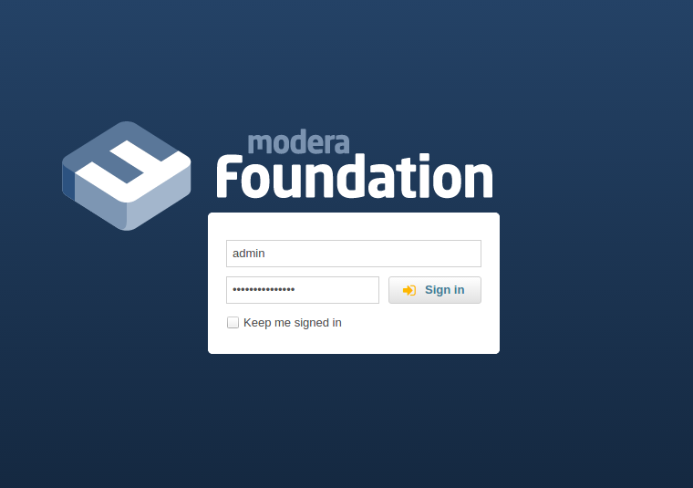

# Modera Foundation

RAD platform for developing applications using Symfony, Doctrine, ExtJS ([MJR](https://mjr.modera.org/)).



## Installation

> **NB!** Firstly: [configure environment](.whaler/README.md)

Go to directory where you cloned this repository and execute these commands:

``` bash
whaler start --init
whaler run php. 'bin/console modera:security:create-user'
```
